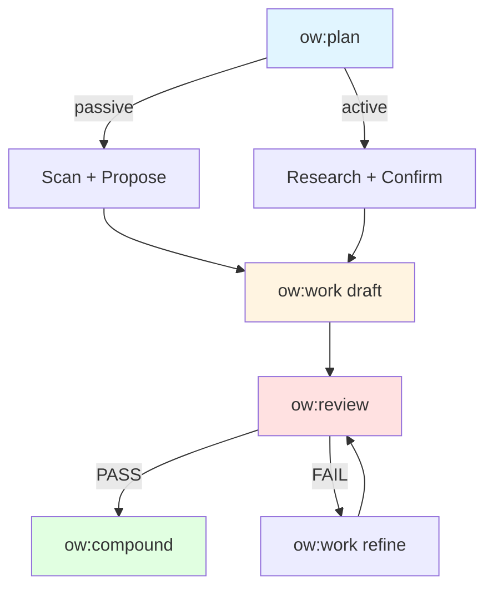

# Quick Start Guide

obsidian-workflows 플러그인을 빠르게 시작하는 가이드입니다.

## 빠른 블로그 작성 (5분) - Fast Mode

Fast mode는 속도를 최우선으로 하는 간소화된 워크플로우입니다. 검증 단계를 최소화하고 핵심 기능만 실행합니다.

### 1. 아이디어 제안 받기

최근 작성한 노트를 분석해서 블로그 아이디어를 제안받습니다.

```bash
/obsidian-workflows:ow:plan --fast --intent passive
```

**Fast mode 효과:**
- 외부 도구 탐지 건너뛰기
- 초기화 검증 간소화
- Context Card 최소화
- 예상 시간: ~2분 (일반 모드: ~3.5분)

### 2. 초안 작성

제안받은 아이디어 중 하나를 선택해서 초안을 작성합니다.

```bash
/obsidian-workflows:ow:work --fast proposal="Workflows/Proposals/passive-proposals/2026-03-04-ideas.md" idea=1
```

**Fast mode 효과:**
- Proposal 파일 읽기만 (검증 생략)
- SOUL 규칙 간소화 적용
- Wikilinks 생성 생략
- 예상 시간: ~1분 (일반 모드: ~1.7분)

### 3. 검토

작성된 초안이 정책을 준수하는지 빠르게 검토합니다.

```bash
/obsidian-workflows:ow:review --fast file="Workflows/Drafts/my-draft.md"
```

**Fast mode 효과:**
- 필수 섹션 검증만
- 상세 체크리스트 생략
- PASS/FAIL만 반환
- 예상 시간: ~0.8분 (일반 모드: ~1.6분)

**총 소요 시간: ~4분** (일반 모드: ~7분, **43% 빠름**)

---

## 정밀 작업 (15분) - Full Mode

복잡한 주제나 첫 실행 시에는 전체 검증과 리서치를 포함한 full mode를 사용합니다.

### 1. 리서치 포함 계획

주제를 정하고 웹 리서치를 수행합니다.

```bash
/obsidian-workflows:ow:plan --intent active topic="Kubernetes 1.32 새로운 기능"
```

**Full mode 동작:**
- WebSearchPrime으로 최신 정보 수집
- 외부 도구 자동 탐지 및 활용
- 전체 초기화 검증
- 상세한 Context Card 출력

### 2. 정책 준수 초안

선택한 정책에 맞춰 초안을 작성합니다.

```bash
/obsidian-workflows:ow:work mode=active topic="Kubernetes 1.32 새로운 기능" policy=technical-blog
```

**Full mode 동작:**
- 정책 계약 전체 검증
- SOUL 규칙 완전 적용
- Wikilinks 자동 생성
- 외부 도구 통합 (humanizer 등)

### 3. 상세 검토

정책 준수 여부를 상세하게 검토합니다.

```bash
/obsidian-workflows:ow:review file="Workflows/Drafts/kubernetes-1-32.md" --verbose
```

**Full mode 동작:**
- 구조/길이/필수 섹션 전체 검증
- 상세한 체크리스트 제공
- 구체적 수정 제안
- 외부 도구 활용 (grammar-checker, style-guide)

### 4. 학습 캡처 (선택)

완성본에서 패턴을 학습하고 SOUL을 개선합니다.

```bash
/obsidian-workflows:ow:compound file="Workflows/Final/kubernetes-1-32.md"
```

**총 소요 시간: ~15분** (리서치 포함)

---

## 모드 선택 가이드

### Fast Mode를 사용하세요

- ✅ 단순한 주제 (이미 잘 아는 내용)
- ✅ 빠른 프로토타이핑
- ✅ 반복 작업 (동일한 정책으로 여러 번)
- ✅ 시간이 촉박할 때

### Full Mode를 사용하세요

- ✅ 복잡한 주제 (리서치 필요)
- ✅ 첫 실행 (초기화 필요)
- ✅ 팀 협업 (정책 준수 필수)
- ✅ 장기 프로젝트 (일관성 중요)

---

## 워크플로우 다이어그램



---

## 다음 단계

- [명령어 상세 가이드](../commands/ow/) - 각 명령어의 전체 옵션
- [설정 가이드](../config/writing-config.example.md) - 워크플로우 커스터마이징
- [정책 작성](../assets/writing-policy.template.md) - 커스텀 정책 만들기
- [SOUL 가이드](../assets/SOUL.template.md) - 글쓰기 스타일 정의

---

## 문제 해결

### "초기화되지 않았습니다" 오류

Fast mode에서는 초기화 검증을 건너뛰므로, 첫 실행 시 full mode로 초기화하세요:

```bash
/obsidian-workflows:ow:plan --intent passive
```

### Fast mode가 너무 느림

Fast mode는 평균 50% 빠르지만, 첫 실행이나 복잡한 작업에서는 효과가 적을 수 있습니다. 반복 작업에서 가장 효과적입니다.

### 정책 준수 실패

Fast mode는 검증을 간소화하므로, 정책 준수가 중요하면 full mode를 사용하세요.
