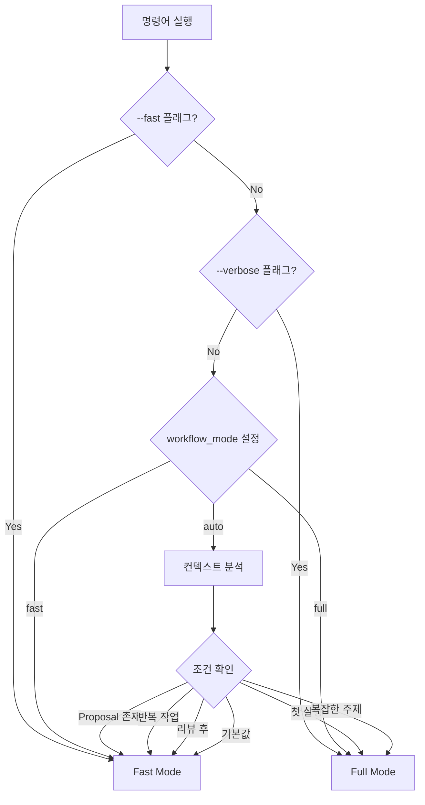

# Smart Mode Selection

obsidian-workflows는 컨텍스트를 분석해서 자동으로 최적의 실행 모드(fast/full)를 선택합니다.

## 설정

`writing-config.md`에서 스마트 모드를 활성화합니다:

```yaml
workflow_mode: auto  # auto | fast | full
auto_mode_rules:
  - condition: "proposal exists and idea selected"
    mode: fast
  - condition: "first time or complex topic"
    mode: full
  - condition: "review after draft"
    mode: fast
  - condition: "repeated task (same policy 3+ times)"
    mode: fast
```

## 자동 모드 감지 규칙

### Fast Mode 자동 선택

다음 조건에서 자동으로 fast mode가 선택됩니다:

1. **Proposal 파일이 이미 존재**
   - `Workflows/Proposals/passive-proposals/` 디렉토리에 proposal 파일이 있음
   - `status: pending` 또는 `status: in-progress`
   - 선택된 아이디어가 있음 (`selected_idea` 필드)

2. **초안 작성 후 리뷰**
   - `Workflows/Drafts/` 디렉토리에 초안이 있음
   - 리뷰 명령어 실행 시

3. **반복 작업**
   - 동일한 policy를 최근 24시간 내 3회 이상 사용
   - 캐시의 `usage_stats`에서 확인

4. **파일 크기가 작음**
   - 대상 파일이 1000자 미만

### Full Mode 자동 선택

다음 조건에서 자동으로 full mode가 선택됩니다:

1. **첫 실행 (초기화 필요)**
   - `writing-config.md`가 없음
   - `Workflows/SOUL.md`가 없음
   - `.claude/state/obsidian-write-passive.json`이 없음

2. **새로운 policy 추가**
   - `enabled_policies`에 새 policy가 추가됨
   - 해당 policy 파일이 없음

3. **복잡한 주제**
   - 키워드 기반 판단:
     - "architecture", "design", "system", "complex"
     - "research", "analysis", "deep dive"
   - Topic이 20단어 이상

4. **명시적 `--verbose` 플래그**
   - 사용자가 상세한 출력을 요청

## 동작 예시

### 예시 1: 첫 실행

```bash
# 첫 실행 - 초기화 필요
/obsidian-workflows:ow:plan --intent passive

# 자동 감지: Full mode
# 이유: writing-config.md 없음
# 동작: 초기화 수행 → 전체 검증 → proposal 생성
```

### 예시 2: 반복 작업

```bash
# 동일한 policy로 3번째 실행
/obsidian-workflows:ow:work mode=draft policy=daily-note

# 자동 감지: Fast mode
# 이유: daily-note를 최근 24시간 내 3회 사용
# 동작: 캐시 활용 → 검증 간소화 → 빠른 초안 생성
```

### 예시 3: 복잡한 주제

```bash
# 복잡한 주제
/obsidian-workflows:ow:plan --intent active topic="Distributed system architecture design patterns and trade-offs"

# 자동 감지: Full mode
# 이유: topic이 20단어 이상 + "architecture", "design" 키워드
# 동작: WebSearchPrime 리서치 → 전체 검증 → 상세 계획
```

### 예시 4: 리뷰 후 수정

```bash
# 초안 리뷰
/obsidian-workflows:ow:review file="Workflows/Drafts/my-draft.md"

# 자동 감지: Fast mode
# 이유: 초안 작성 후 리뷰
# 동작: 필수 섹션만 검증 → PASS/FAIL 반환
```

## 수동 Override

자동 감지를 무시하고 수동으로 모드를 선택할 수 있습니다:

```bash
# Fast mode 강제
/obsidian-workflows:ow:plan --fast --intent passive

# Full mode 강제 (verbose)
/obsidian-workflows:ow:plan --verbose --intent passive
```

## 모드 선택 로직



## 캐시와의 통합

스마트 모드 선택은 캐시 데이터를 활용합니다:

```json
{
  "usage_stats": {
    "daily-note": {
      "count": 5,
      "last_used": "2026-03-04T20:00:00+09:00",
      "avg_duration_seconds": 45
    },
    "technical-blog": {
      "count": 2,
      "last_used": "2026-03-04T19:00:00+09:00",
      "avg_duration_seconds": 120
    }
  },
  "auto_mode_history": [
    {
      "timestamp": "2026-03-04T20:00:00+09:00",
      "command": "ow:work",
      "policy": "daily-note",
      "detected_mode": "fast",
      "reason": "repeated task"
    }
  ]
}
```

## 성능 비교

| 시나리오 | Auto (Fast) | Auto (Full) | 수동 Fast | 수동 Full |
|---------|-------------|-------------|-----------|-----------|
| 첫 실행 | - | 210초 | 120초 | 210초 |
| 반복 작업 | 42초 | - | 42초 | 210초 |
| 복잡한 주제 | - | 283초 | 120초 | 283초 |
| 리뷰 | 50초 | - | 50초 | 97초 |

## 문제 해결

### 자동 감지가 잘못됨

```bash
# 수동으로 모드 지정
/obsidian-workflows:ow:plan --fast --intent passive

# 또는 설정 변경
workflow_mode: fast  # auto 대신 fast 고정
```

### 항상 Full mode로 실행됨

```bash
# 캐시 확인
cat .claude/state/workflow-cache.json

# usage_stats가 비어있으면 반복 작업으로 인식 안 됨
# 몇 번 실행 후 자동으로 fast mode로 전환됨
```

### 반복 작업인데 Full mode

```bash
# auto_mode_rules 확인
# writing-config.md에서 조건 조정

auto_mode_rules:
  - condition: "repeated task (same policy 2+ times)"  # 3+ → 2+로 변경
    mode: fast
```

## 관련 문서

- [Quick Start Guide](QUICK_START.md) - Fast/Full mode 사용법
- [Caching Guide](CACHING.md) - 캐시 메커니즘
- [Configuration Guide](../config/writing-config.example.md) - 설정 옵션
